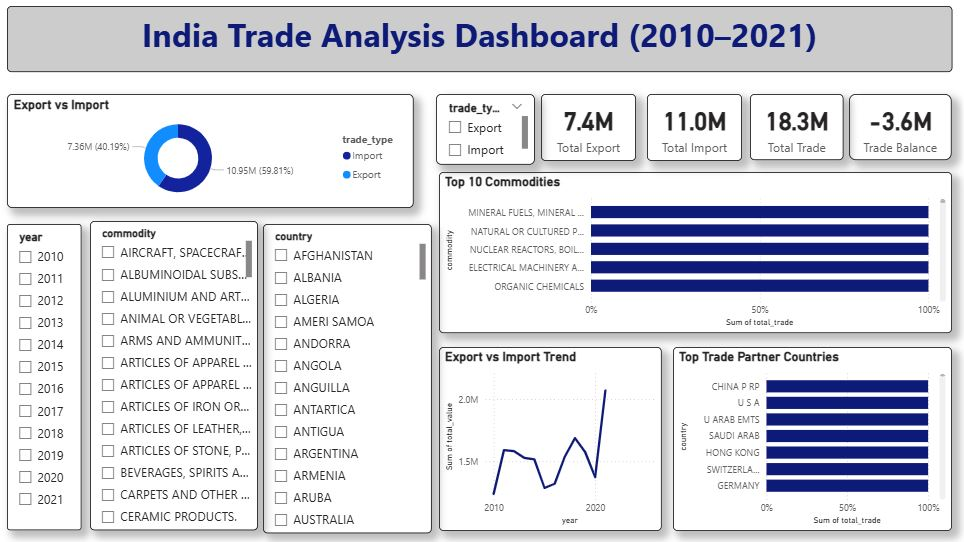

# 🇮🇳 India Trade Analysis Dashboard (2010–2021)

## 📌 Project Overview
India is one of the fastest developing nations in the world, and international trade is a key contributor to its economic growth.  
This project analyzes India's **Export and Import trade data** from **2010 to 2021** using HS2 commodity classification.

An interactive dashboard was built to visualize trade trends, top commodities, major partner countries, and trade balance.

---

## 🎯 Problem Statement
The objective of this project is to answer important trade-related business questions:

- What commodities does India export the most?
- Which commodities form the major portion of imports?
- Who are India’s top trading partner countries?
- How has trade changed from 2010 to 2021?
- What is the overall trade balance of India?

---

## 📊 Dataset Information
- **Source:** Kaggle – India Trade Data  
- **Time Period:** 2010–2021  
- **Unit:** Trade value in Million US Dollars  
- **Commodities:** HS2 Basket

---

## 🛠 Tools & Technologies Used
- **Python (Pandas)** – Data cleaning and preprocessing  
- **PostgreSQL** – Database storage and SQL analysis  
- **Power BI** – Interactive dashboard development  
- **GitHub** – Project version control and portfolio sharing  

---

## 🔄 Project Workflow
1. Business Problem Definition  
2. Data Loading & Cleaning in Python  
3. Exporting cleaned dataset  
4. Loading data into PostgreSQL  
5. Writing SQL queries for analysis  
6. Developing Power BI Dashboard  
7. Report and Presentation preparation  
8. Uploading project on GitHub  

---

## 📈 Dashboard Preview

### ✅ India Trade Analysis Dashboard

> *(Add your Power BI dashboard screenshot here)*



---

## 📌 Key Dashboard Features
- Export vs Import Trend (2010–2021)
- Top 10 Commodities by Trade Value
- Top Trade Partner Countries
- KPI Metrics (Total Export, Total Import, Trade Balance)
- Interactive Filters (Year, Country, Commodity, Trade Type)

---

## ✅ Key Insights
- India’s imports were higher than exports, resulting in a trade deficit.
- Major trade partners include **China, USA, UAE, and Saudi Arabia**.
- Commodities like **Mineral Fuels and Machinery** dominate India’s trade basket.
- Trade values increased significantly over the years.

---

## 📂 Project Structure

```bash
India-Trade-Analytics/
│
├── dataset/
├── notebooks/
├── sql_scripts/
├── powerbi_dashboard/
├── report/
└── presentation/
